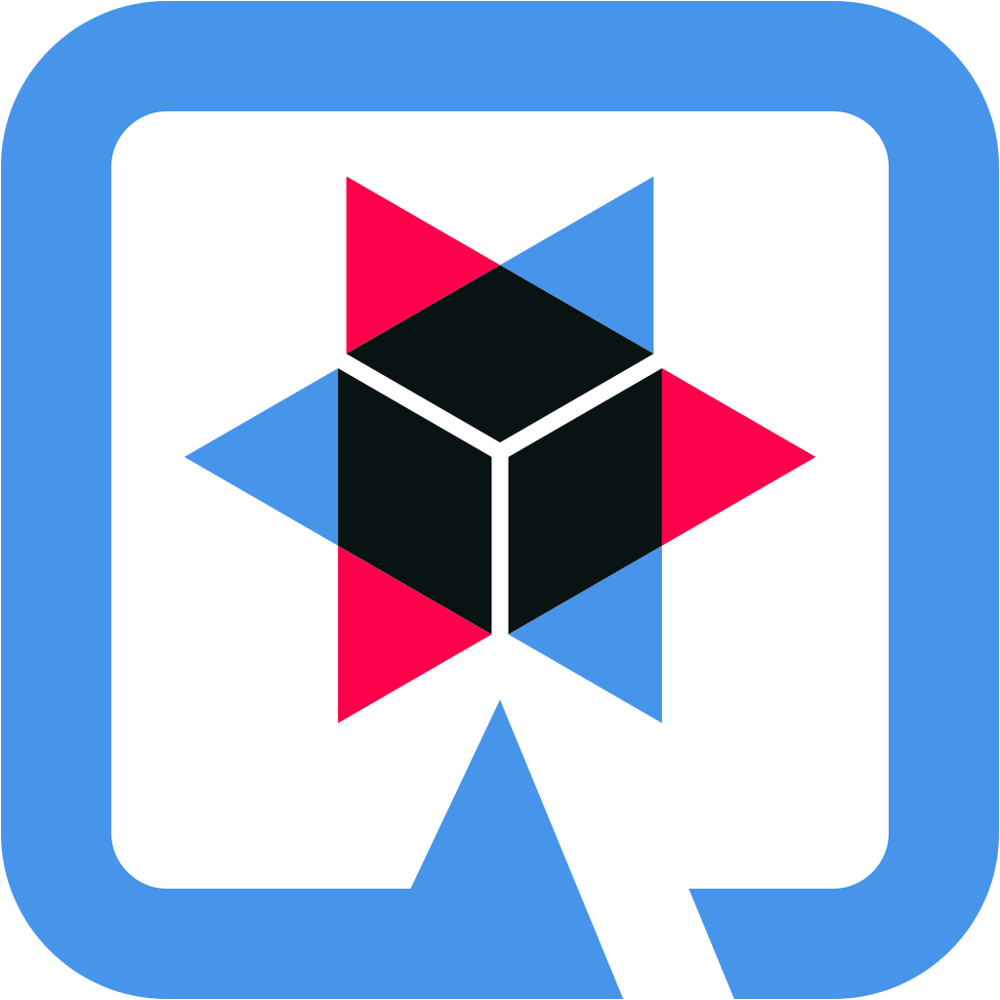

## About me

###

📚 I'm currently learning: `SpringBoot` & `Hibernate` **specifics**

🧑‍💻Topics interested in: DB optimizations, regular expressions for the text parsing/processing

🎯 Goals: avoid replacing initial intelligence with artificial one

###

## I code with

###

  
  
  
  
  
  
  
  

###
